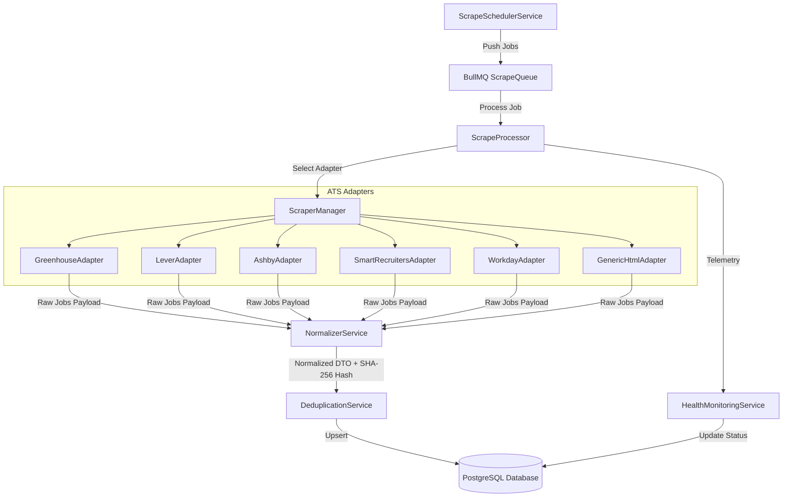
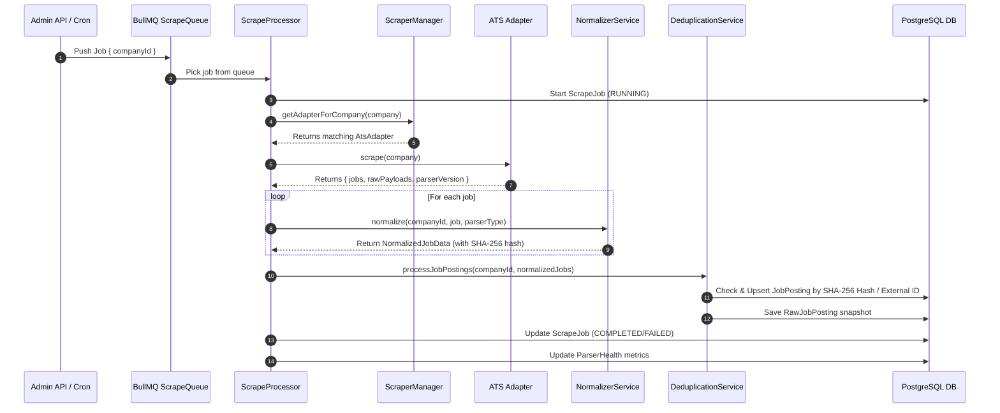

# Internship Collection Engine – Developer Guide

The Internship Collection Engine is a high-throughput, plugin-based monitoring system built on NestJS, Prisma, BullMQ, Playwright, and Cheerio. It is responsible for discovering, normalizing, deduplicating, and persisting internship postings across thousands of companies.

---

## 🏛 System Architecture



---

## 🔄 Execution Sequence Diagram



---

## 🛠 How to Add a New ATS Adapter

The system is designed with the **Open-Closed Principle (SOLID)**. Adding support for a new ATS provider (e.g. `Workable`, `Teamtailor`, or `BambooHR`) requires zero changes to existing adapters or core workers.

### Step 1: Add new `ParserType` in Prisma Schema

Edit `apps/api/prisma/schema.prisma`:

```prisma
enum ParserType {
  GREENHOUSE
  LEVER
  WORKDAY
  ASHBY
  SMARTRECRUITERS
  GENERIC_HTML
  WORKABLE // <--- New parser type
  CUSTOM
  UNASSIGNED
}
```

Then run: `npm --workspace=apps/api run prisma:generate`

### Step 2: Implement the `AtsAdapter` interface

Create a new file `apps/api/src/scrapers/adapters/workable.adapter.ts`:

```typescript
import { Injectable } from '@nestjs/common';
import { Company, ParserType } from '@prisma/client';
import { BaseAtsAdapter } from './base.adapter';
import { CollectedJob, CollectedJobResult } from '../interfaces/ats-adapter.interface';

@Injectable()
export class WorkableAdapter extends BaseAtsAdapter {
  readonly name = 'WorkableAdapter';
  readonly parserType = ParserType.WORKABLE;

  supports(company: Company): boolean {
    if (company.parserType === ParserType.WORKABLE) return true;
    return !!(company.careerPageUrl && company.careerPageUrl.includes('workable.com'));
  }

  async scrape(company: Company): Promise<CollectedJobResult> {
    const boardToken = this.extractBoardToken(company.careerPageUrl, company.slug);
    const apiUrl = `https://apply.workable.com/api/v3/accounts/${boardToken}/jobs`;

    const response = await fetch(apiUrl, {
      method: 'POST',
      headers: { 'Content-Type': 'application/json' },
      body: JSON.stringify({ limit: 100 }),
    });

    if (!response.ok) {
      throw new Error(`Workable API request failed: ${response.status}`);
    }

    const data = await response.json();
    const rawJobs = data.results || [];

    const jobs: CollectedJob[] = rawJobs.map((rawJob) => ({
      externalJobId: String(rawJob.shortcode),
      title: this.cleanText(rawJob.title) || 'Untitled Position',
      department: this.cleanText(rawJob.department),
      location: this.cleanText(rawJob.location?.city),
      workMode: this.inferWorkMode(`${rawJob.title} ${rawJob.telecommute}`),
      experienceLevel: this.inferExperienceLevel(rawJob.title),
      applicationUrl: `https://apply.workable.com/${boardToken}/j/${rawJob.shortcode}`,
      postedDate: rawJob.published ? new Date(rawJob.published) : undefined,
      rawJson: rawJob,
    }));

    return {
      jobs,
      rawPayloads: rawJobs,
      parserVersion: '1.0.0',
    };
  }
}
```

### Step 3: Register in `ScraperManager` & `ScrapersModule`

1. Inject your new adapter into `ScraperManager` constructor and add it to `this.adapters`.
2. Add your new adapter to the `providers` array in `apps/api/src/scrapers/scrapers.module.ts`.

---

## 🔑 Deduplication Hashing Strategy

To prevent duplicate job records when companies re-post or update listings, every normalized job posting generates a stable SHA-256 hash:

$$\text{hash} = \text{SHA256}(\text{companyId} : \text{externalJobId} : \text{title} : \text{location} : \text{canonicalUrl})$$

If the hash already exists in PostgreSQL, the engine updates `updatedAt` and ensures `status = ACTIVE` without creating a duplicate record.

---

## 📊 Health Monitoring Metrics

Every scrape execution records metrics in two tables:

- `ScrapeJob`: Historical record of individual execution runs (duration, jobs found, jobs added, jobs updated, error message).
- `ParserHealth`: Moving-average success rates and average runtime per company parser.
